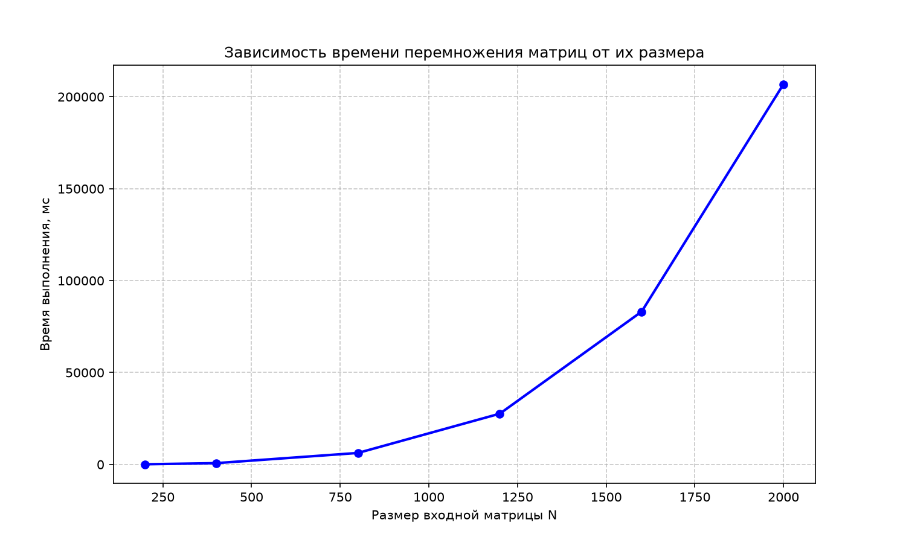

## Лабораторная работа №1
# Задание:
Реализация перемножения двух квадратных матриц N x N на C++ с замером времени выполнения и построением графика зависимости времени от размера матрицы.

# Проект:

| Файл                     | Назначение                                    |
|--------------------------|-----------------------------------------------|
| `matrix_multiplier.cpp`  | Перемножение матриц                           |
| `generate_matrices.py`   | Генерация двух случайных матриц `N x N`       |
| `build_plot.py`          | Построение графика                            |
| `CMakeLists.txt`         | Конфигурация сборки CMake                     |
| `matrix1.txt`            | Первая входная матрица (генерируется)         |
| `matrix2.txt`            | Вторая входная матрица (генерируется)         |
| `result.txt`             | Результат перемножения                        |
| `timings.txt`            | Результаты замеров времени                    |
| `graph.png`              | Итоговый график                               |

# Результат:
На графике видна характерная кубическая зависимость времени выполнения
от размера матрицы:

